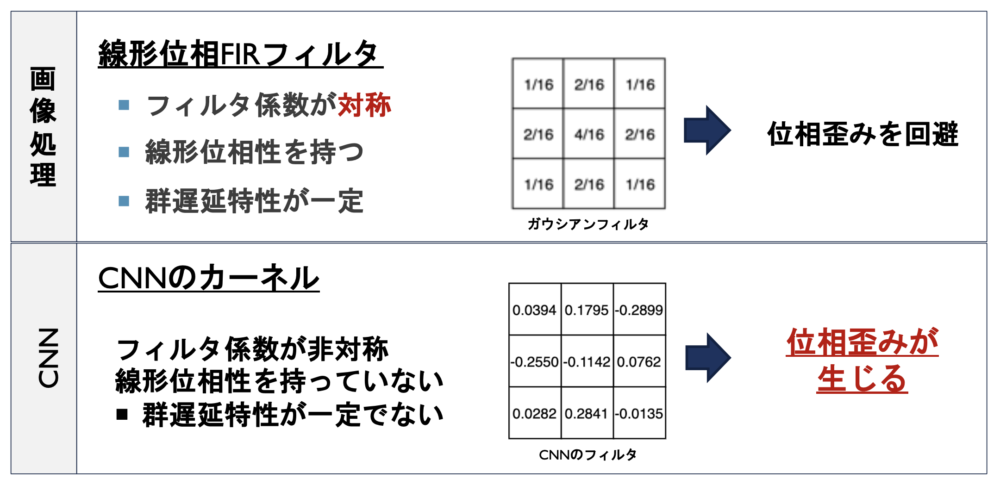
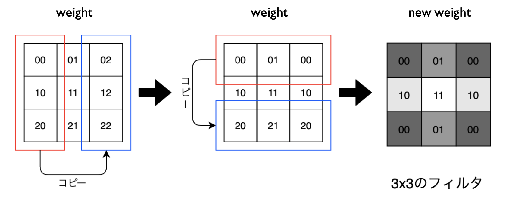
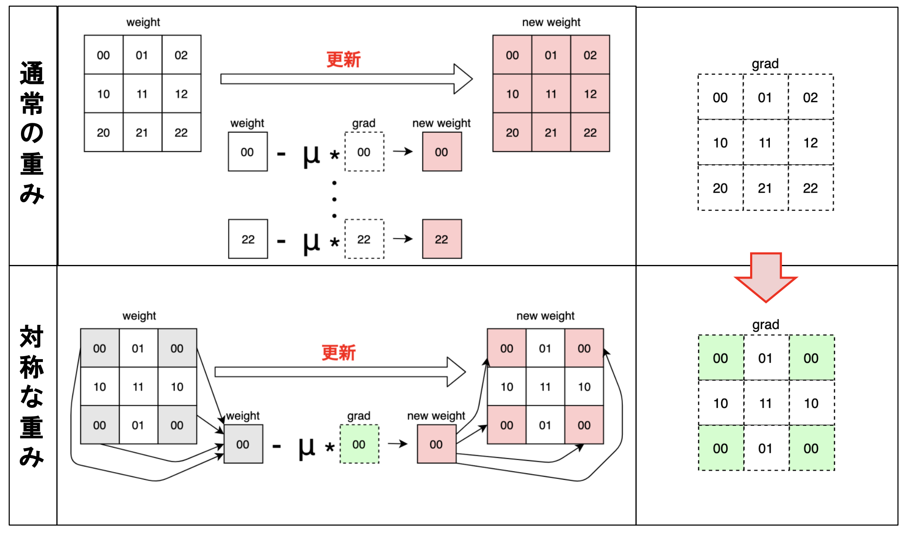
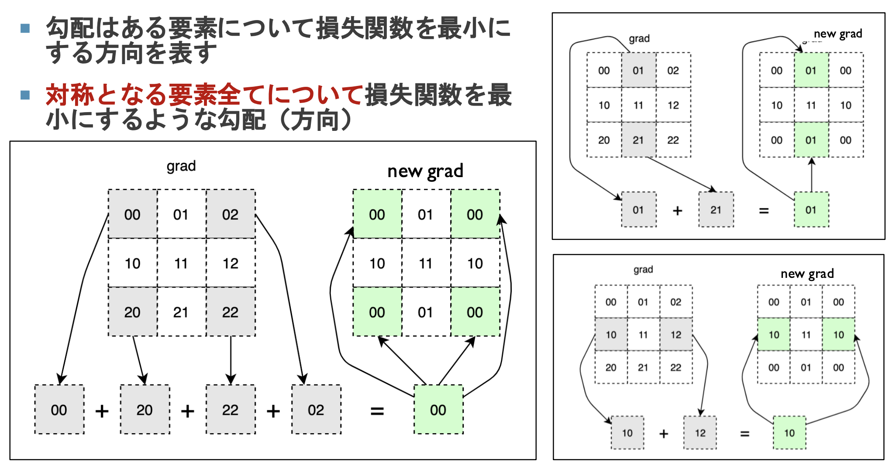
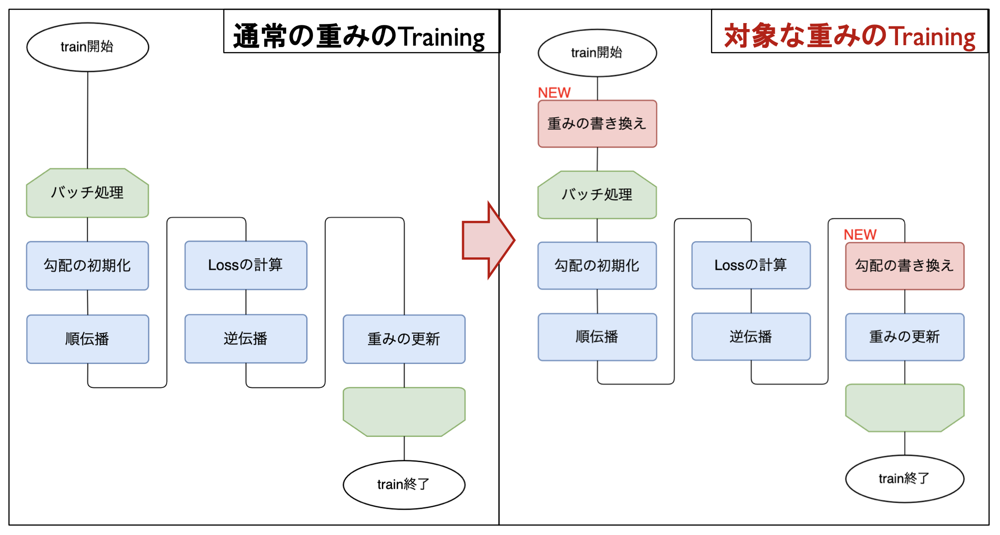
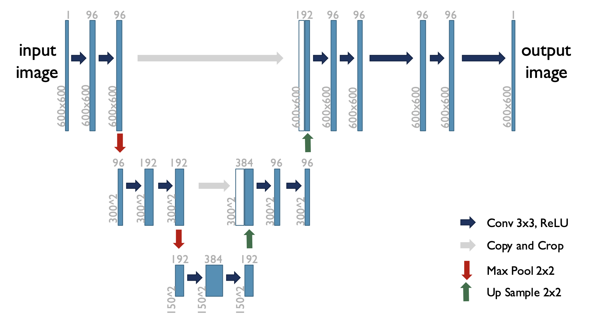

# Supervised-learning-with-linear-phase-FIR-filters
CNNカーネルに線形位相FIRフィルタを用いた，教師あり学習によるノイズ除去を行う．

# 研究背景・目的
画像処理のノイズ除去におけるフィルタ演算すなわち畳み込み演算では，対称的な構造をとる線形位相FIRフィルタが用いられる．
これは，畳み込み演算による位相歪みの影響を避けるためである．

一方，CNNを用いたノイズ除去における畳み込み演算では，カーネルは対称的な構造をとっておらず線形位相性を持っていないため，その出力は位相歪みの影響を受けることが考えられる．

そのため，本研究の目的は，
- CNNカーネルを線形位相FIRフィルタに書き換え，
- その効果について考察する．

こととなる．

# 提案手法
CNNカーネル（重み）を対称的な構造に書き換え，線形位相性を与えることを提案する．
ここでは，その方法について示す．．

## 重みの書き換え

## 重みの更新

## 勾配の書き換え

## 対称な重みの学習

# 実験
教師あり学習による画像のノイズ除去を行う．
- 損失関数 : MSELoss
- ネットワーク : U-Net

# 結果
